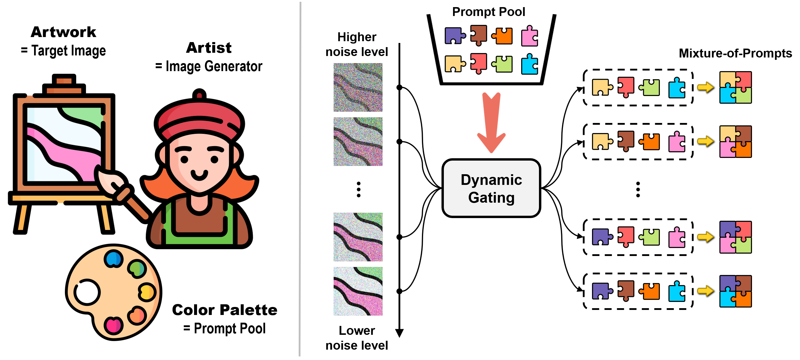
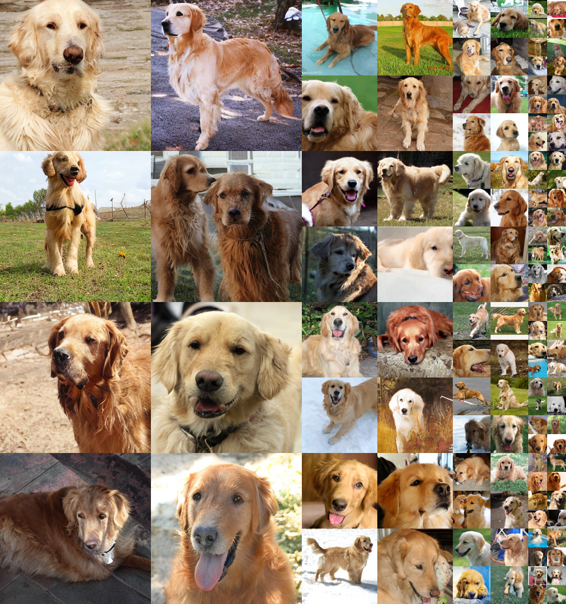

# Denoising Model Patching via Mixture-of-Prompts
<!-- Arxiv Link, Project Link -->
<a href="https://arxiv.org/abs/2405.17825"></a>
<a href="https://sangminwoo.github.io/DMP/"></a>

This repository contains the official pytorch implementation of the paper: "Diffusion Model Patching via Mixture-of-Prompts".


## Updates

 * **2024.05.29**: Build project page.
 * **2024.05.28**: Code Release.


## Overview

<!-- Please Insert generated Images. -->
<p align="center" width="100%">

</p>
Our approach incorporates a pool of prompts within the input space, with each prompt learned to excel at certain stages of the denoising process. This is similar to giving a skilled artist an expanded color palette to refine different aspects of their artwork. At every step, mixture-of-prompts is constructed via dynamic gating based on the current noise level. This mechanism is akin to an artist choosing the appropriate color combinations for specific moments.


## Method: Diffusion Model Patching (DMP)

<p align="center" width="100%">

</p>
Diffusion Model Patching (DMP) is a simple method to boost the performance of pre-trained diffusion models that have already reached convergence, with a negligible increase in parameters.


## ImageNet 256x256 Results



Generated sample (*golden retriever*) from **DiT-XL/2 + DMP (w/ cfg=1.5)**.


Generated sample (*goldfish*) from **DiT-XL/2 + DMP (w/ cfg=1.5)**.

<!-- 

Generated sample (*hummingbird*) from **DiT-XL/2 + DMP (w/ cfg=1.5)**. -->


Generated sample (*ostrich*) from **DiT-XL/2 + DMP (w/ cfg=1.5)**.


## Setup
<a href="https://pytorch.org/get-started/locally/"></a>
<a href="https://hydra.cc/"></a>

We use a 80GB A100 GPU for all experiments. 
```
conda create -n ENV_NAME python=3.10
```
```
python3 -m pip install -r requirements.txt
```


## Training DiT with DMP

We provide an example training script for ImageNet.
 
```
torchrun --nnodes=1 --nproc_per_node=1 train.py general.data_path='<PATH_TO_DATASET>'
```

You can also modify the DiT model, optimization type, sharing ratio, etc.

```
torchrun --nnodes=1 --nproc_per_node=1 train.py \
general.data_path='<PATH_TO_DATASET>' \
models.name="DiT-L/2" \
models.routing.sharing_ratio=0.8
```

## Sampling DiT with DMP
After training, the checkpoint and log files are saved based on the configuration.
Consequently, you need to execute the sampling script using the same configuration as the training script. 
Additionally, you can adjust the number of sampling images and the classifier-guidance scale.

```
torchrun --nnodes=1 --nproc_per_node=1 sample_ddp.py \
models.name="DiT-L/2" \
eval.cfg_scale=1.5 \
eval.num_fid_samples=50000
```

Please refer to the [example scripts](https://github.com/sangminwoo/DMP/blob/master/example_script.sh) for detailed instructions how to reproduce our results.
In this script, we enumerate the configurations that can be modified if needed.


## Results

Patching the pre-trained DiT models with DMP. We set two baselines for comparison: (1) conventional fine-tuning to update the model parameters. (2) naive prompt tuning. Note that we use the same dataset as in the pre-training. Image Resolution is 256 X 256.


## BibTeX

```bibtex
@article{ham2024diffusion,
  title={Diffusion Model Patching via Mixture-of-Prompts},
  author={Ham, Seokil and Woo, Sangmin and Kim, Jin-Young and Go, Hyojun and Park, Byeongjun and Kim, Changick},
  journal={arXiv preprint arXiv:2405.17825},
  year={2024}
}
```

## Acknowledgments
This codebase borrows from most notably [DIT](https://github.com/facebookresearch/DiT), [ANT](https://github.com/gohyojun15/ANT_diffusion), [DTR](https://github.com/byeongjun-park/DTR).